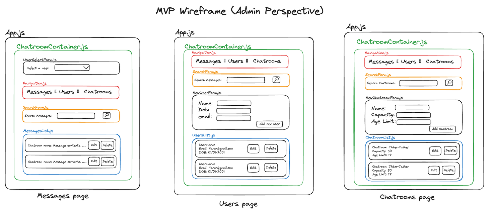
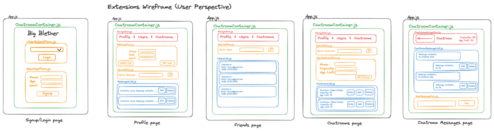
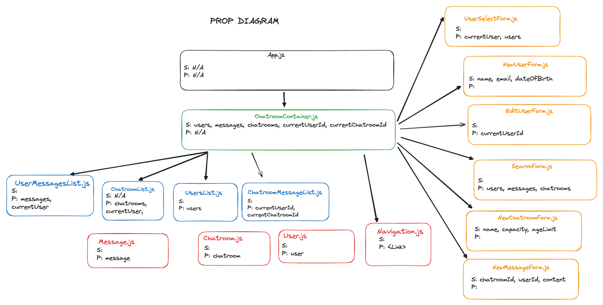

# Big Blether chatroom by KARYT & Co

The frontend of https://github.com/osamui01/blether-backend-copy

## Contents
1. [Project Aims](#project-aims)
2. [MVP](#mvp)
3. [Extensions](#extensions)
4. [Libraries](#libraries)
5. [Credits](#credits)
6. [Resources](#resources)
7. [Licenses](#licenses)

## Project Aims

Our project aim is to create a client-side interactive chatroom for a server-side Spring API previously created by the back-end team. Our initial intention was to create this chatroom with an admin perspective with the ability to view, edit and delete all users, messages and chatrooms. This was later adapted to cater to a user-oriented experience by creating functionality to allow a user to login/signup where we could implement age-restricted chatrooms and allow users to enter many chatrooms with multiple users.

## MVP

### Initial Approach
Planning:
* [x] Create trello board to track tasks to do, completed tasks and log errors
* [x] Create wireframe
* [x] Create props diagram

<!-- 
Old MVPs:
Users:
* [x] Admin can delete user
* [x] Admin can enter new user details
* [x] Admin can update user details
* [x] Admin can search/filter users
Chatrooms:
* [x] Admin can create a chatroom
* [x] Admin can update chatroom details
* [x] Admin can delete a chatroom
* [x] Admin search/filter chatrooms
Messages:
* [x] Admin can view users messages
-->

Started off with admin perspective.



Build on top of admin dashboard to create user oriented website with sign up and profile pages.
Pivot to user perspective

Login page:
* [x] User can login/select themselves from list
* [x] User can register new user

Profile page:
* [x] User can edit their details
* [x] User can search through their own messages

Users page:
* [x] User can search through other users on the site

Chatrooms page:
* [x] User can search chatrooms
* [x] User can create a new chatroom
* [x] User can enter a chatroom

Chatroom Messages page:
* [x] Users can post messages
* [x] Users can view messages within a chatroom
* [x] Users can delete messages




### Further Extensions for the Future

* [ ] Infinite scrolling for messages in a chatroom
* [ ] Different CSS layouts for each page
* [ ] Edit existing messages

## Libraries

The names and versions of any libraries used:

1. React: Version 18.2.0
2. React Router DOM: Version 6.22.3

### Prerequisites

- Node.js https://nodejs.org/en/download

### Installation

1. Clone the repository:

    ```bash
    git clone https://github.com/osamui01/blether-frontend
    ```

2. Navigate to the project directory:

    ```bash
    cd blether-frontend
    ```

3. Install the dependencies:

    ```bash
    npm install
    ```

### Usage

1. Start the development server:

    ```bash
    npm start
    ```

2. Open your browser and visit [`http://localhost:3000`](http://localhost:3000) to view the application.

### Contributing

Contributions are welcome! Please follow these steps:

1. Fork / clone the repository.
2. Create a new branch: 
    ```bash
    git checkout -b feature/your-feature-name
    ```
3. Make your changes and commit them: 
    ```bash
    git commit -m 'Add some feature'
    ```
4. Push to the branch: 
    ```bash
    git push origin feature/your-feature-name
    ```
5. Submit a pull request at:  [`https://github.com/osamui01/blether-frontend/pulls`](https://github.com/osamui01/blether-frontend/pulls).

## Credits

Give credit to the contributors of the project:
|   |    |    Name     |         Github                        |
|---|----|---------|---------------------------------|
| K | 🌱 | Karen   | https://github.com/karenyip1999 |
| A | 🦧 | Aebel   | https://github.com/Aebel-Shajan |
| R | 🥕 | Ralph   | https://github.com/osamui01     |
| Y | 🐼 | Yesica  | https://github.com/ney601       |
| T | 🎋 | Tommy   | https://github.com/Tommybui28   |

## Resources

1. https://www.cdnfonts.com/cartoon.font

## Licenses

[](https://opensource.org/licenses/MIT)
